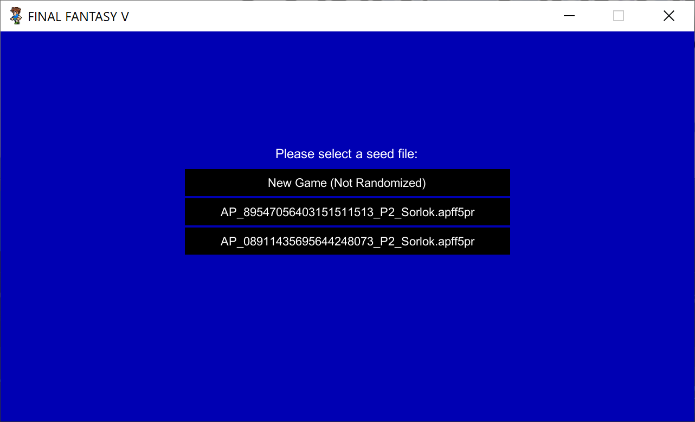
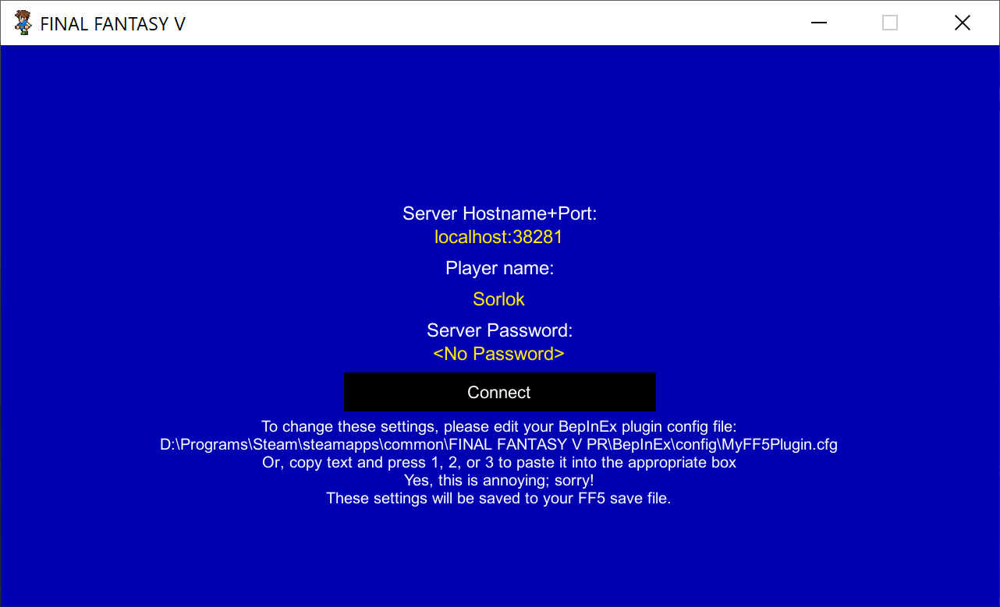
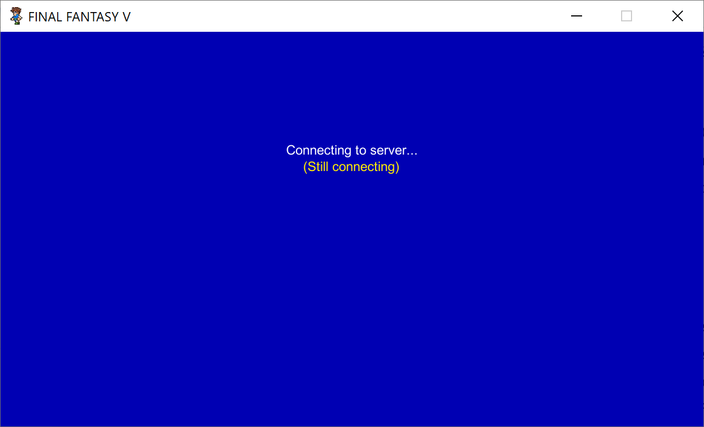
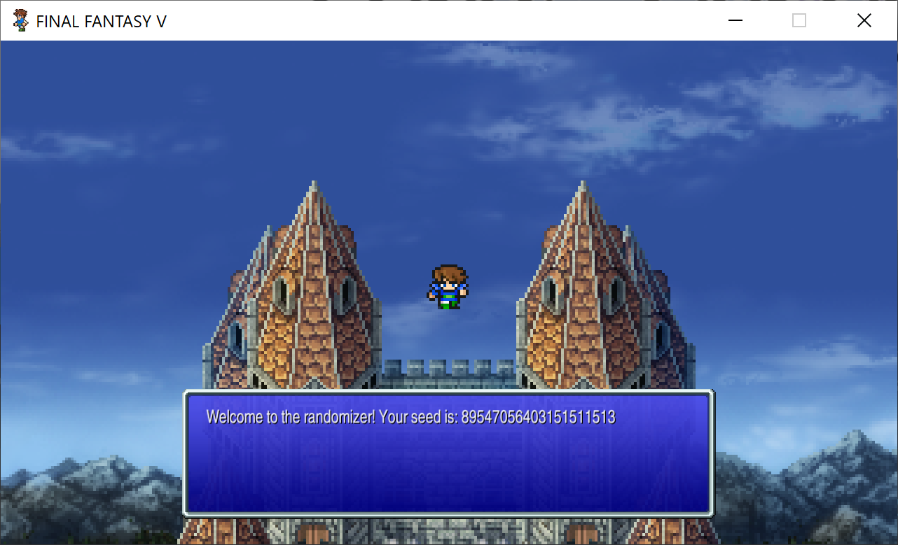

# FF5 Pixel Remaster Archipelago Randomizer
This is a custom world for the Archipelago multi-world randomizer (https://archipelago.gg/). It lets you play Final Fantasy V (Pixel Remaster) as part of an Archipelago shared seed.

## $${\color{red}WARNING}$$
This is currently a prototype, so don't expect too much. The main limitation is that it's currently only for World 1, but you should read the "Limitations" and "Bugs" section for more things to watch out for. Please file Issues if you run into anything, but be patient --I work on this in my free time, and it's rarely my #1 priority. With that in mind, thank you so much for trying out my fun side project!

## What's the Randomizer Like?
Start in World 1 with the Airship and fly around to (almost) any location, opening treasure chests, defeating bosses, and gettin crystal shards. The treasures are randomly shuffled, and the crystals/bosses can be anything at all ---Jobs, special Items (like Adamantite), and even items from other game's worlds, if you set it up that way! Unlocking 10 Jobs will also unlock the warp to World 2, which for now counts as completing the randomizer (since I haven't touched World 2 yet).

## Patching Final Fantasy V (One Time)

1. Download BepInEx version 6.0.0-pre.2 (https://github.com/BepInEx/BepInEx/releases/tag/v6.0.0-pre.2). The exact name of the file you need is "BepInEx-Unity.IL2CPP-win-x64-6.0.0-pre.2.zip"
2. Right-click on "Final Fantasy V Pixel Remaster" in Steam, and choose "Properties...", then pick the "Installed Files" tab, then press the "Browse..." button. This will open up the Final Fantasy V folder in Window Explorer. You can also open it manually (default is: C:\Program Files (x86)\Steam\steamapps\common\FINAL FANTASY V PR).
3. Open the BepInEx zip file you downloaded, and everything into the Final Fantasy V folder.
4. Run Final Fantasy V once, then close it when it gets to the title screen. (This will allow BepInEx to create a few necessary folders and files.)
5. Now, download the latest "FF5Rando" file from the Releases page (TODO: link).
6. Within the Final Fantasy V folder, browse to the "BepInEx\plugins" folder. Now, open the FF5Rando zip, and copy all three DLL files into the plugins folder.
7. Run the game again, then look for the file "BepInEx\config\MyFF5Plugin.cfg" in the Final Fantasy V folder. If that file got created, then your install was successful!

## Installing Archipelago and the Custom World (One Time)

1. If you haven't already, download the Archipelago and install it (https://github.com/ArchipelagoMW/Archipelago/releases). This is needed because FF5 is not officially suported by Archipelago, so you'll have to generate the Multi World yourself (you can still play it on their servers).
2. Next, open the FF5Rando zip file (from the latest Release).
3. Copy the file (TODO: X) to your Archipelago folder's "custom_worlds" directory.
4. Go into the your Archipelago's "Players" folder, and create a .yaml file for FF5. A sample one is provided here: (TODO: link), but you should modify the "Name" to be the name you prefer to go by in-game.
5. You will also need a .yaml file for each other player (based on whichever games they're playing). This is covered in more detail here: https://archipelago.gg/tutorial/Archipelago/setup_en#playing-with-custom-worlds
6. Once you've got all your .yaml files in place, double-click "ArchipelagoGenerate.exe" and wait for it to report "Success".

## How to Play a Randomizer Seed

1. Every time you run "ArchipelagoGenerate.exe", it will generate a new multi-world for you to play. If you go to your Archipelago's "output" folder, you'll see a file named something like "AP_08911435695644248073.zip" (one per world you've generated).
2. Open this zip file, and you'll see a file named something like "AP_08911435695644248073_P<Slot>_<Name>.apff5pr". The "Slot" and "Name" will be based on your .yaml files, but the ".apff5pr" is the important part. This is a special zip file that contains everything needed to randomize your version of FF5.
3. Create a folder named "Rando" inside of your Final Fantasy V installed folder at "FINAL FANTASY V_Data\StreamingAssets\Rando".
4. Copy the the ".apff5pr" file from the zip into the "Rando" folder. You can have multiple ".apff5pr" files in this folder; the game will let you pick the one you want to play.
5. You will also see a file named something like "AP_08911435695644248073.archipelago". You'll want to copy this out of the zip file and somewhere convenient (you can put it in the Rando folder if you like, but really anywhere is fine). Double-clicking this file will launch the local Archipelago server. (If you plan to use the Archipelago web site to host your game, you can ignore this step.)

You've now got everything set up. Launch Final Fantasy V from Steam, and select "New Game". You'll see a new menu that looks something like the following. Use the mouse to pick the seed you want to play. The seed you pick will be added to your Save file, so you'll be able to save+load multiple seeds in multiple different files. And if you want to play vanilla FF5, you can just select (TODO) (or load a save file that has no seed information) and the FF5Rando will get out of your way.

Anyway, once you pick a seed, you'll see another menu asking you to confirm your server settings. You'll need to enter the server's address and password (if any), and you may choose to manually override your username --although that's not typically required. The server's address will be something like "localhost:38281" if you are running the ".archipelago" server locally, and "archipelago.gg:<some_port>" if you are using the web site. **Note**: In order to change this information, the easiest way is to copy the value you want (Ctrl+C) and then press number keys "1", "2", or "3" to paste that information into the "Server Address", "Password", or "Username" boxes respectively. You could also edit the file "MyFF5Plugin.cfg" in "BepInEx\config". Yes, I know this is super janky.

Once you've got your server information set up correctly, press Connect and you'll see the following screen. Behind the scenes, FF5 is trying to connect to the server and login to the game. If there's any error, you'll see that error printed to the screen. 

If it works correctly, the login screen will disappear, and you'll see the opening screen for FF5, but with a twist.

You can now play the FF5 Randomizer!

## Limitations

* Only World 1 is randomized for now. The plan is to get Worlds 2 and 3, each with their own unlock conditions, and then the final dungeon + boss. But I'm keeping it small for now.
* All bosses except Crystal bosses and Ramuh give you an extra "check". Crystal bosses don't because crystals already give you multiple checks. Ramuh doesn't because I can't figure out how to hack battle events. :)
  * Karlabos and Cray Claw cannot be fought, but that's mostly because I can't figure out a good way to hook the events.
* This is not a limitation, but you need the Adamantite to access the Ronka Ruins, and you neat to clear the Fire-Powered ship to access the chests in Karnak Castle. Once unlocked, both locations remain accessible forever. (TODO: Move this to a 'general' section)
* Not exacty a limitation, but we start with Encounters "off". Press F3 to turn them on again.
* Boss stats are not currently scaled, so Wing Raptor will always be weak and Titan will always be strong. FF5 is a game of exploits, though, so I'm figuring out if it makes sense to adjust this.
  * I would also like to add EXP/AP rewards for bosses, but I haven't figured out how much I want them to give.
  * I also want to give 3x XP/AP in general; just a reminder...
* The magic in chests isn't randomized (Mute, Speed, Teleport, and Float).
* If you "Load" a save file from within the game (i.e., not from the title screen), you won't be given any multi-world items until you open+close a menu or enter combat.
* Bosses effectively give their items twice --once as drops when you defeat them, and again due to their being added to the initial item pool. When we modify boss XP/AP, I need to remove default boss drops.
* The server hostname/port/password is saved into your Save File (which is a feature), but there is no way to change it. I'll need to add a "Connection" menu.
* If you can't connect to the AP server, you won't be able to play your seeded save files. Actually, everything *would* work fine offline (it would just sync when you rejoin); I just need to add a button.
* I'm not sure if the .NET client I'm using reconnects if the server goes down. Need to test this, and make sure our Item/Location behavior is correct in that case.
* I need to add a "Teleport to World 1" item, and the logic to block it in certain maps. This is needed to avoid soft-locking, and to make Worlds 2+3 easily accessible.
  * FF5's teleport is very broken in World 1 (since you're not supposed to have it), AND some of my patches don't reset the Teleport location properly. I need to catch all these cases, or to do it in a more automated way...
* More...

## Bugs

* Sometimes the game just crashes for no reason. Just try again; it seems to be random (either my code or BepInEx's). Auto Save should hopefully protect you from any major data loss.
* I have not tested it, but I'm pretty sure giving the player an Item from Admin (the console) will make it confused w.r.t. Player Name
* I need to implement get_filler_item_name() (just using tags is fine), since otherwise you could get weird stuff as a filler
* The guy in Carwen won't move out of the way of the barrel (normally he does this after beating North Mountain ---I want it to always be open)
* 

## Possible Features & Balance

* It would make sense to start with a random job unlocked; this removes the redundancy of "just use rods with Freelancer"
* I'd like to have some amount of shop randomization at some point.
* I want to force combat on in the Walse basement, but maybe people will just cheese it with Quicksave, so it might not be worth it.

## Directories

If you're just **playing** this mod, you can ignore all of these directories. If you're **developing** this mod, you'll see the following when you clone the source:
* Data - Contains processed data extracted from the game once we're happy with it. I've got a more complete Google Doc I'm working on; some of these files are out of date.
* MyFF5Plugin - Contains a BepInEx plugin that mods FF5 on the fly to do what we want it to do.
* Sample - Just some random hand-generated files I'm playing around with. Not relevant.
* Scripts - Various Python scripts that analyze resources from the game and help with the process of randomization. This requires a Magicite export of game assets. 
* custom_world/ff5pr - Contains the World implementation for Archipelago. If you're working on improving the mod, you can copy the 'ff5pr' directory into the 'lib/worlds' folder of an Archipelago installation, and then use the string 'Final Fantasy V PR' in your Player.yml to generate a seed with FF5 in the mix!

